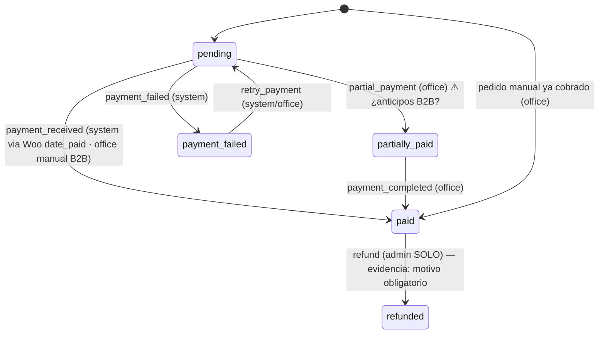
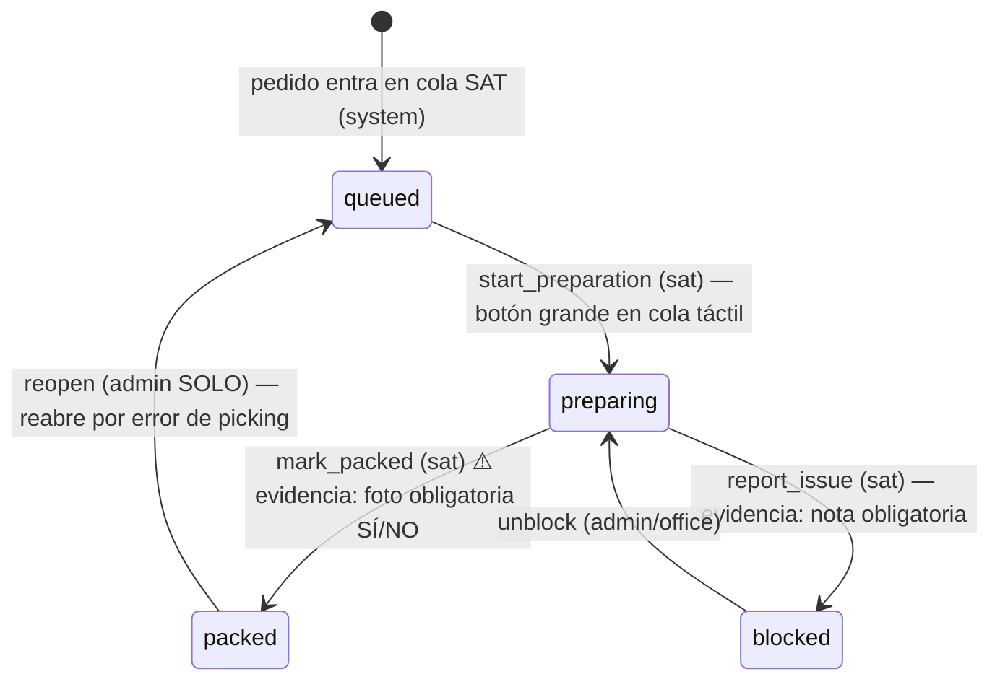
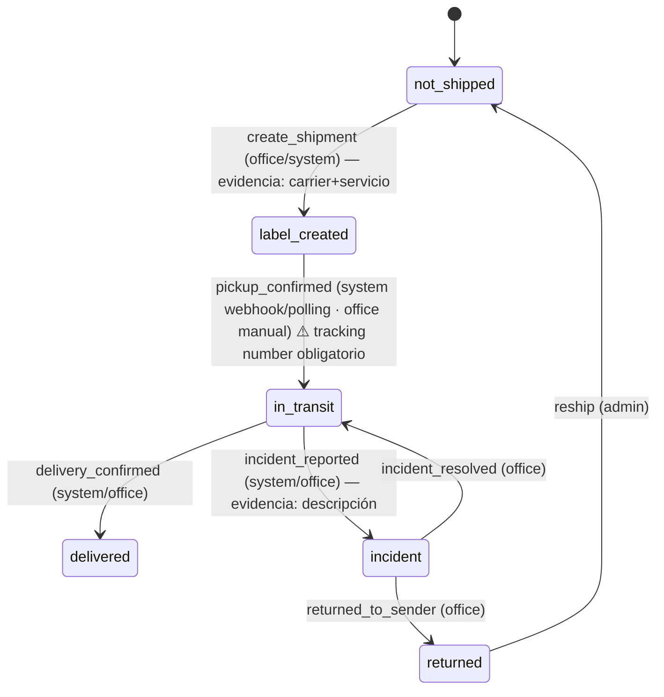
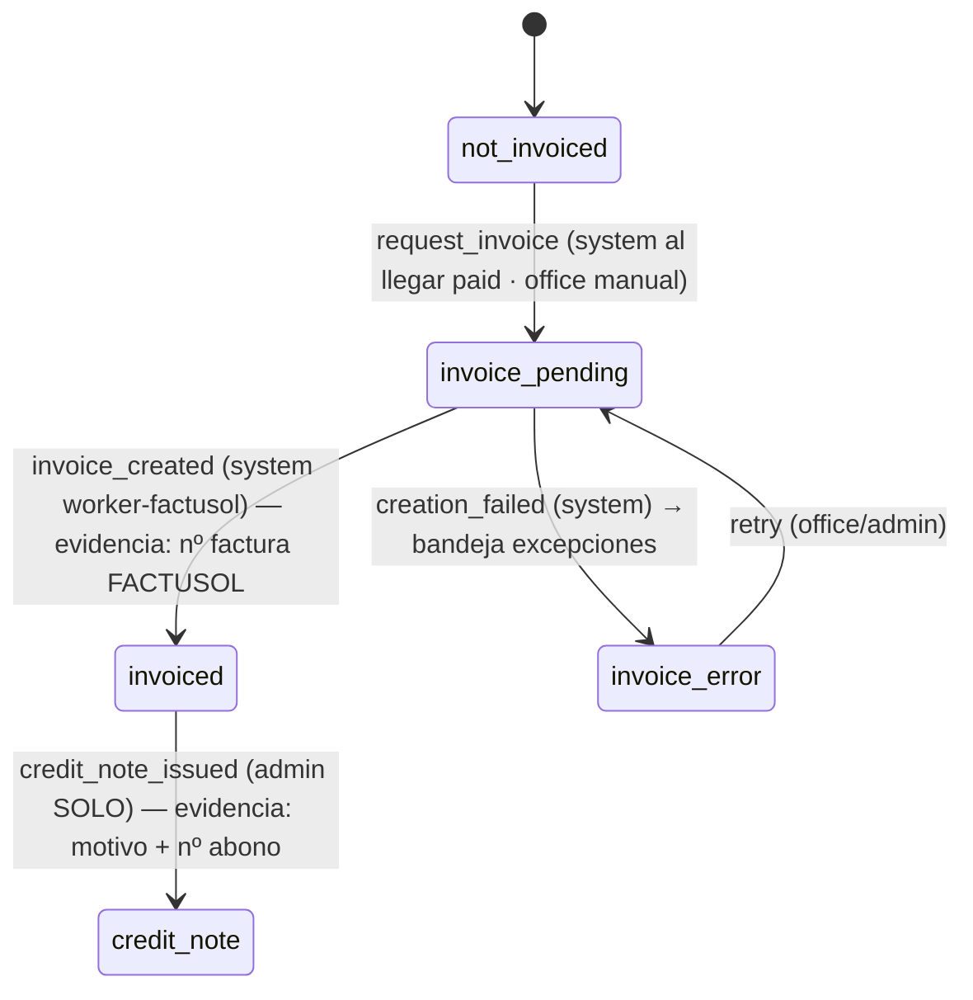

# Máquinas de estado del pedido — 4 dominios independientes

Cada pedido lleva **4 máquinas de estado paralelas** (decisión cerrada):
pago, preparación, transporte y facturación. Ninguna bloquea a las otras
salvo los cruces explícitos marcados como *guard*. Cada transición se
registra en `order_state_history` (quién, cuándo, evidencia, origen
manual/webhook/api).

**PROPUESTA para cerrar con Bart** — las transiciones/roles/evidencias
marcadas ⚠️ son las que necesitan su confirmación explícita.

Roles: `admin` (Bart), `sat` (técnico taller), `office` (administración),
`system` (webhooks/sync automáticos).

## 1. Pago (fuente de verdad: WooCommerce / manual en pedidos B2B)

- `payment_received` automático: webhook `order.updated` con `date_paid`
  poblado (no existe topic nativo `payment_complete`, ver woocommerce-integration.md).
- ⚠️ Pregunta a Bart: ¿existen anticipos/pagos parciales en B2B (palés)?
  Si no, se elimina `partially_paid` del MVP.

## 2. Preparación (fuente de verdad: cola SAT del ERP)

- ⚠️ Pregunta a Bart: ¿la foto del bulto antes de `packed` es obligatoria
  (evidencia adjunta) u opcional? Impacta la UI táctil del SAT.
- *Guard*: `start_preparation` requiere pago `paid` **salvo** override
  `admin` (⚠️ ¿se prepara sin cobrar en B2B con crédito?).

## 3. Transporte (fuente de verdad: Genei/DSV, entrada manual mientras no haya API)

- *Guard*: `create_shipment` requiere preparación `packed`.
- ⚠️ Confirmación Bart: `in_transit` exige `tracking_number` no vacío (la
  transición falla sin él) — parece obvio pero fuerza disciplina manual
  mientras DSV/Genei van por entrada manual.

## 4. Facturación (fuente de verdad: FACTUSOL)

- *Guards*: `request_invoice` requiere pago `paid` Y todos los SKU del
  pedido con mapping confirmado (excepción `sku_unmapped` si no, ver
  sku-conciliation.md). La numeración de factura la asigna FACTUSOL —
  el ERP NUNCA inventa números (pendiente de confirmar política de
  numeración en el descubrimiento de la API).
- ⚠️ Pregunta a Bart: ¿factura automática al cobrar (pedidos web) o
  siempre con revisión manual en `invoice_pending`?

## Matriz de permisos (resumen)

| Transición | admin | office | sat | system |
|---|---|---|---|---|
| payment_received | ✔ | ✔ | ✖ | ✔ |
| refund | ✔ | ✖ | ✖ | ✖ |
| start_preparation / mark_packed | ✔ | ✖ | ✔ | ✖ |
| reopen (packed→queued) | ✔ | ✖ | ✖ | ✖ |
| create_shipment | ✔ | ✔ | ✖ | ✔ |
| incident_* | ✔ | ✔ | ✖ | ✔ |
| request_invoice / retry | ✔ | ✔ | ✖ | ✔ |
| credit_note_issued | ✔ | ✖ | ✖ | ✖ |

Implementación (Sprint 1): tabla de transiciones declarativa (dominio,
from, to, roles[], evidencia_requerida[], guards[]) validada en el service
layer — misma filosofía que `trigger_definitions.py` de workflows: datos,
no ifs dispersos.
